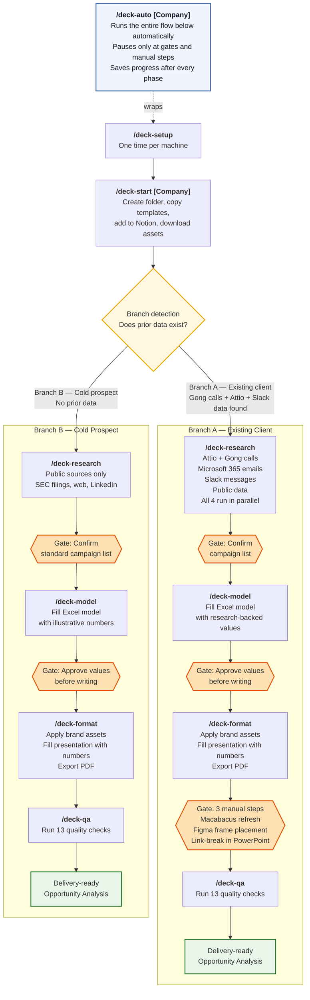

# jolly-marketplace

Jolly's internal Claude Code plugin marketplace. Add this once and you can install any Jolly plugin.

---

## Quick Install (new teammate setup)

Run these two commands in Claude Code — that's it:

```
claude plugin marketplace add https://github.com/nishant-jolly/jolly-marketplace
```
```
/plugin install opportunity-analysis@nishant-jolly
```

Then use `/deck-auto [Company]` to run the full workflow.

---

## Available plugins

| Plugin | What it does | Install command |
|--------|-------------|-----------------|
| `opportunity-analysis` | Research, model, and format a client Opportunity Analysis from start to finish | `/plugin install opportunity-analysis@nishant-jolly` |

---

## Workflow overview



---

## Adding a new plugin

1. Create the plugin repo under `nishant-jolly/`
2. Add it to `.claude-plugin/marketplace.json` in this repo
3. Teammates run `claude plugin marketplace update` to pick up the new plugin
